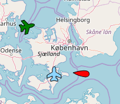

# leaflet-marker-vessel
>

## Description
Provide different vessels (ships, airplanes etc.) as leaflet marker
 

## Installation
### bower
`bower install https://github.com/FCOO/leaflet-marker-vessel.git --save`

## Demo
http://FCOO.github.io/leaflet-marker-vessel/demo/ 

## Usage
    var greenAirplane =
        L.vesselMarker([56, 11], {
            shape: 'airplane',
            color: 'green'
        })
        .setHeading(75)
        .addTo(map);

### options
| Id | Type | Default | Description |
| :--: | :--: | :-----: | --- |
| `shape` | `string` | `"airplane"`| Name of the shape: `"boat"` or `"airplane"` |
| `color` | `string` | `"#8ED6FF"`| Color of the vessel |
| `heading` | `number` | 0 | The heading of the vessel |
| `dim` | `number` | 30 | The dimensions of the marker |

Plus the normal options for `L.Marker`

### Constructor
    L.vesselMarker( latlng, options );

### Methods
        .setHeading: function(heading)
        .setShape  : function(shape)
        .setColor  : function(color)

## Copyright and License
This plugin is licensed under the [MIT license](https://github.com/FCOO/leaflet-marker-vessel/LICENSE).

Copyright (c) 2018 [FCOO](https://github.com/FCOO)

## Contact information

Niels Holt nho@fcoo.dk

## Credits and acknowledgments

Based on [leaflet.boatmarker v1.1.0 by Thomas Brüggemann](https://github.com/thomasbrueggemann/leaflet.boatmarker )
